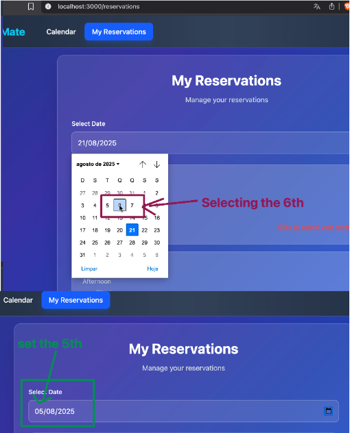

# BUG005 - Date-picker in "My reservations" page selects an invalid date

| Field                 | Description                                                                                                                                 |
|-----------------------|---------------------------------------------------------------------------------------------------------------------------------------------|
| **ID**                | BUG005                                                                                                                                     |
| **Title**             | Date-picker in "My reservations" page selects an invalid date                                                                             |
| **Tester**            | Jmercado                                                                                                                                   |
| **Date**              | 20/08/2025                                                                                                                                 |
| **Expected result**   | The date-picker should use the date selected by the user                                                                                   |
| **Actual result**     | The date-picker available on "My reservations" page is selecting a day -1                                                                 |
| **Priority**          | Low                                                                                                                                        |
| **Severity**          | Minor                                                                                                                                      |
| **Software information** | BookingMate v1.0 Chrome 139.0 and Firefox 142.0                                                                                    |
| **Traceability**      | TC10, TC11                                                                                                                                 |
| **Status**            | Open                                                                                                                                       |
| **Evidence**          |  Console shows no errors, but the date-picker is selecting a day -1. |
