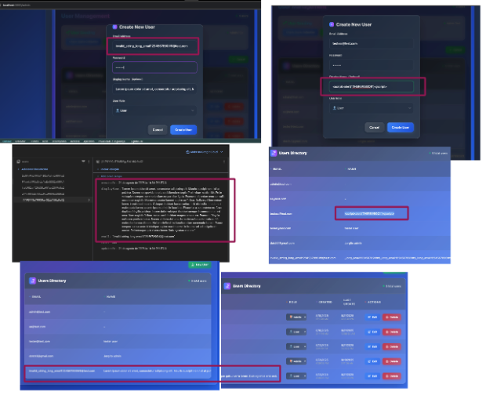

# BUG009 - There is not validation nor sanitization for the field's "email" and "displayName" on the Create new user and edit user modals

| Field                 | Description                                                                                                                                 |
|-----------------------|---------------------------------------------------------------------------------------------------------------------------------------------|
| **ID**                | BUG009                                                                                                                                     |
| **Title**             | There is not validation nor sanitization for the field's "email" and "displayName" on the Create new user and edit user modals         |
| **Tester**            | Jmercado                                                                                                                                   |
| **Date**              | 20/08/2025                                                                                                                                 |
| **Expected result**   | When user is created or edited the value entered on "email" and "displayName" should be properly validated and sanitized                |
| **Actual result**     | The "email" and "displayName" fields are vulnerable to enter any type of data without validation or sanitization                        |
| **Priority**          | High                                                                                                                                       |
| **Severity**          | Critical                                                                                                                                   |
| **Software information** | BookingMate v1.0 Chrome 139.0 and Firefox 142.0                                                                                    |
| **Traceability**      | TC17                                                                                                                                       |
| **Status**            | Open                                                                                                                                       |
| **Evidence**          |  Console shows no errors, but the user is created with invalid data. |