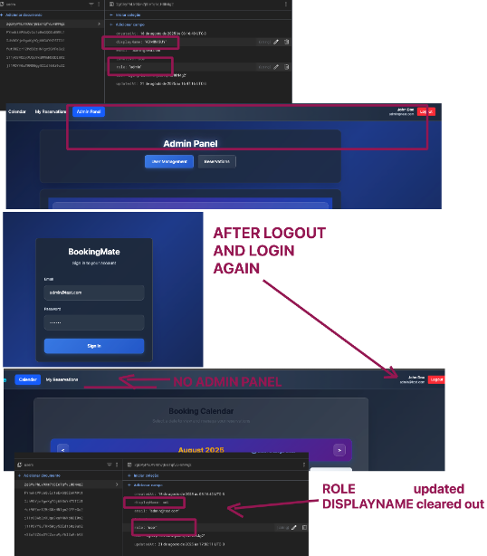

# BUG010 - Admin user has its role changed to "user" and the "displayName" cleared out every time it performs login

| Field                 | Description                                                                                                                                 |
|-----------------------|---------------------------------------------------------------------------------------------------------------------------------------------|
| **ID**                | BUG010                                                                                                                                     |
| **Title**             | Admin user has its role changed to "user" and the "displayName" cleared out every time it performs login                                |
| **Tester**            | Jmercado                                                                                                                                   |
| **Date**              | 20/08/2025                                                                                                                                 |
| **Expected result**   | When an admin user performs a login its data in /users collection should not be updated                                                    |
| **Actual result**     | Admin has its role changed to "user" and the "displayName" cleared out after to login into the system                                   |
| **Priority**          | High                                                                                                                                       |
| **Severity**          | Critical                                                                                                                                   |
| **Software information** | BookingMate v1.0 Chrome 139.0 and Firefox 142.0                                                                                    |
| **Traceability**      | N/A                                                                                                                                        |
| **Status**            | Open                                                                                                                                       |
| **Evidence**          |  Admin user has its role changed to "user" and the "displayName" cleared out after to login into the system. |