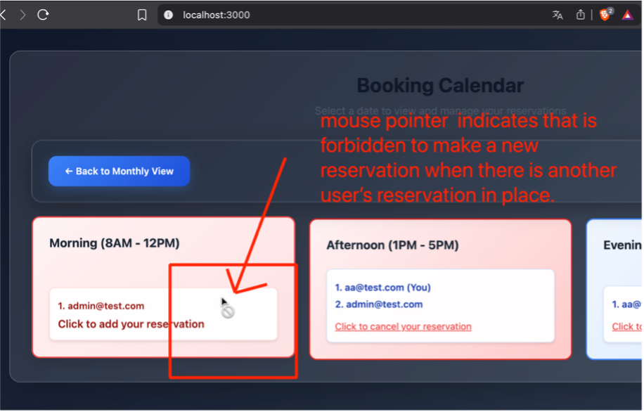
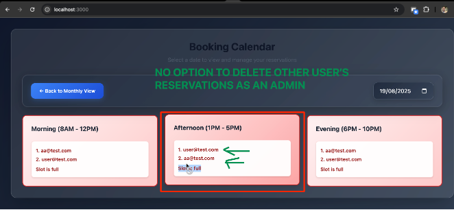

# Defect Reports

Template based on ISO-29119-3 and in bug tracker tools.

## Valid Statuses

The valid statuses defined by the team are the following:

1. **New / Open** → defect just reported.
2. **Triage / In Review** → team (QA + Dev + PO) validates if the defect is real, duplicate, out of scope, or expected behavior.
3. **Backlog** → defect is valid but not prioritized for the current sprint (it can go to the Product Backlog for future planning).
4. **To Do / Accepted** → defect is confirmed and planned to be fixed in the sprint.
5. **In Progress / Fixing** → developer is actively working on the fix.
6. **Fixed / Ready for Retest** → developer marked it as resolved, waiting for QA validation.
7. **Retest / QA In Progress** → QA is re-checking the reported issue.
8. **Closed / Done** → fix is validated, defect is no longer reproducible.
9. **Rejected / Not a Bug** → defect was invalid (expected behavior, duplicate, environment issue, etc.).
10. **Deferred** → defect is valid, but fix is postponed (similar to backlog but explicitly marked as "won't fix now").

---

### 🐞 Reports

---

| Field                 | Description                                                                                                                                 |
|-----------------------|---------------------------------------------------------------------------------------------------------------------------------------------|
| **ID**                | BUG001                                                                                                                                     |
| **Title**             | Mouse pointer shows forbidden icon, confusing the user when trying to create a new reservation in a slot with existing reservations        |
| **Tester**            | Jmercado                                                                                                                                   |
| **Date**              | 20/08/2025                                                                                                                                 |
| **Expected result**   | The mouse pointer should not display the forbidden icon.                                                                                  |
| **Actual result**     | The mouse pointer displays the forbidden icon, confusing the user into thinking no more reservations can be made in that slot.            |
| **Priority**          | Low                                                                                                                                        |
| **Severity**          | Minor                                                                                                                                      |
| **Software information** | BookingMate v1.0 Chrome 139.0 and Firefox 142.0                                                                                     |
| **Traceability**      | TC4                                                                                                                                        |
| **Status**            | Backlog                                                                                                                                    |
| **Evidence**          |  Console shows no errors, but cursor displays forbidden icon when hovering over occupied time slots. |

---

| Field                 | Description                                                                                                                                                        |
|-----------------------|--------------------------------------------------------------------------------------------------------------------------------------------------------------------|
| **ID**                | BUG002                                                                                                                                                             |
| **Title**             | Admin user cannot cancel other user’s reservations from the Calendar Slot view page                                                                               |
| **Tester**            | Jmercado                                                                                                                                                           |
| **Date**              | 20/08/2025                                                                                                                                                         |
| **Expected result**   | The admin user should have the ability to cancel/delete a reservation of other user from the calendar Slot view page                                             |
| **Actual result**     | There is not an option to cancel/delete another user’s reservation from the Calendar Slot view page for an admin user                                             |
| **Priority**          | Low                                                                                                                                                                |
| **Severity**          | Minor                                                                                                                                                              |
| **Software information** | BookingMate v1.0 Chrome 139.0 and Firefox 142.0                                                                                                              |
| **Traceability**      | TC9                                                                                                                                                                |
| **Status**            | Open                                                                                                                                                               |
| **Evidence**          |  Admin user cannot cancel other user’s reservations from the Calendar Slot view page. |

---
