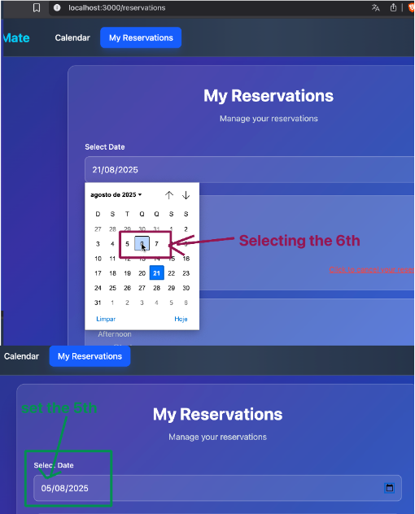

# Defect Reports

Template based on ISO-29119-3 and in bug tracker tools.

## Valid Statuses

The valid statuses defined by the team are the following:

1. **New / Open** → defect just reported.
2. **Triage / In Review** → team (QA + Dev + PO) validates if the defect is real, duplicate, out of scope, or expected behavior.
3. **Backlog** → defect is valid but not prioritized for the current sprint (it can go to the Product Backlog for future planning).
4. **To Do / Accepted** → defect is confirmed and planned to be fixed in the sprint.
5. **In Progress / Fixing** → developer is actively working on the fix.
6. **Fixed / Ready for Retest** → developer marked it as resolved, waiting for QA validation.
7. **Retest / QA In Progress** → QA is re-checking the reported issue.
8. **Closed / Done** → fix is validated, defect is no longer reproducible.
9. **Rejected / Not a Bug** → defect was invalid (expected behavior, duplicate, environment issue, etc.).
10. **Deferred** → defect is valid, but fix is postponed (similar to backlog but explicitly marked as "won't fix now").

---

### 🐞 Reports
---
## BUG001

| Field                 | Description                                                                                                                                 |
|-----------------------|---------------------------------------------------------------------------------------------------------------------------------------------|
| **ID**                | BUG001                                                                                                                                     |
| **Title**             | Reservations are displayed with wrong date (selected date -1 day)                                                                          |
| **Tester**            | Jmercado                                                                                                                                   |
| **Date**              | 20/08/2025                                                                                                                                 |
| **Expected result**   | Reservations should be displayed with the correct date, the date selected by the user at creation time                                     |
| **Actual result**     | When a reservation is created, this is created with correct date but the "My Reservations" and the "Admin Reservations" pages are showing with the difference of 1 day less than the date selected by the user. i.e: selected date -1 day. |
| **Priority**          | High                                                                                                                                       |
| **Severity**          | High                                                                                                                                       |
| **Software information** | BookingMate v1.0 Chrome 139.0 and Firefox 142.0                                                                                    |
| **Traceability**      | TC1, TC5                                                                                                                                   |
| **Status**            | Backlog                                                                                                                                    |
| **Evidence**          |  Console shows no errors, but the reservations are displayed with 1 day less than the selected date. |

## BUG002

| Field                 | Description                                                                                                                                 |
|-----------------------|---------------------------------------------------------------------------------------------------------------------------------------------|
| **ID**                | BUG002                                                                                                                                     |
| **Title**             | Mouse pointer shows forbidden icon, confusing the user when trying to create a new reservation in a slot with existing reservations        |
| **Tester**            | Jmercado                                                                                                                                   |
| **Date**              | 20/08/2025                                                                                                                                 |
| **Expected result**   | The mouse pointer should not display the forbidden icon.                                                                                  |
| **Actual result**     | The mouse pointer displays the forbidden icon, confusing the user into thinking no more reservations can be made in that slot.            |
| **Priority**          | Low                                                                                                                                        |
| **Severity**          | Minor                                                                                                                                      |
| **Software information** | BookingMate v1.0 Chrome 139.0 and Firefox 142.0                                                                                     |
| **Traceability**      | TC4                                                                                                                                        |
| **Status**            | Backlog                                                                                                                                    |
| **Evidence**          |  Console shows no errors, but cursor displays forbidden icon when hovering over occupied time slots. |

## BUG003

| Field                 | Description                                                                                                                                                        |
|-----------------------|--------------------------------------------------------------------------------------------------------------------------------------------------------------------|
| **ID**                | BUG003                                                                                                                                                           |
| **Title**             | Admin user cannot cancel other user’s reservations from the Calendar Slot view page                                                                               |
| **Tester**            | Jmercado                                                                                                                                                           |
| **Date**              | 20/08/2025                                                                                                                                                         |
| **Expected result**   | The admin user should have the ability to cancel/delete a reservation of other user from the calendar Slot view page                                             |
| **Actual result**     | There is not an option to cancel/delete another user’s reservation from the Calendar Slot view page for an admin user                                             |
| **Priority**          | Low                                                                                                                                                                |
| **Severity**          | Minor                                                                                                                                                              |
| **Software information** | BookingMate v1.0 Chrome 139.0 and Firefox 142.0                                                                                                              |
| **Traceability**      | TC9                                                                                                                                                                |
| **Status**            | Open                                                                                                                                                               |
| **Evidence**          |  Admin user cannot cancel other user’s reservations from the Calendar Slot view page. |

## BUG004

| Field                 | Description                                                                                                                                 |
|-----------------------|---------------------------------------------------------------------------------------------------------------------------------------------|
| **ID**                | BUG004                                                                                                                                     |
| **Title**             | "My Reservations" page is listing reservations of other users too                                                                         |
| **Tester**            | Jmercado                                                                                                                                   |
| **Date**              | 20/08/2025                                                                                                                                 |
| **Expected result**   | The "My reservations" should list only the user's reservations and not others                                                             |
| **Actual result**     | The list of reservations in "My Reservations" page is listing the reservations for that day even the ones that belong to other users.   |
| **Priority**          | Low                                                                                                                                        |
| **Severity**          | Minor                                                                                                                                      |
| **Software information** | BookingMate v1.0 Chrome 139.0 and Firefox 142.0                                                                                    |
| **Traceability**      | TC10, TC11                                                                                                                                 |
| **Status**            | Open                                                                                                                                       |
| **Evidence**          |  Console shows no errors, but the "My Reservations" page is listing reservations of other users too. |

## BUG005

| Field                 | Description                                                                                                                                 |
|-----------------------|---------------------------------------------------------------------------------------------------------------------------------------------|
| **ID**                | BUG005                                                                                                                                     |
| **Title**             | Date-picker in "My reservations" page selects an invalid date                                                                             |
| **Tester**            | Jmercado                                                                                                                                   |
| **Date**              | 20/08/2025                                                                                                                                 |
| **Expected result**   | The date-picker should use the date selected by the user                                                                                   |
| **Actual result**     | The date-picker available on "My reservations" page is selecting a day -1                                                                 |
| **Priority**          | Low                                                                                                                                        |
| **Severity**          | Minor                                                                                                                                      |
| **Software information** | BookingMate v1.0 Chrome 139.0 and Firefox 142.0                                                                                    |
| **Traceability**      | TC10, TC11                                                                                                                                 |
| **Status**            | Open                                                                                                                                       |
| **Evidence**          |  Console shows no errors, but the date-picker is selecting a day -1. |

## BUG006

| Field                 | Description                                                                                                                                 |
|-----------------------|---------------------------------------------------------------------------------------------------------------------------------------------|
| **ID**                | BUG006                                                                                                                                     |
| **Title**             | Selecting "clean" on the date-picker component triggers a system error                                                                    |
| **Tester**            | Jmercado                                                                                                                                   |
| **Date**              | 20/08/2025                                                                                                                                 |
| **Expected result**   | The "clean" option on the date-picker component available on "My Reservations" or "Calendar Slot" pages should clear the selections and set to the today date by default |
| **Actual result**     | The "clean" option of date-picker component throws an error: Something went wrong Invalid time value                                      |
| **Priority**          | Medium                                                                                                                                     |
| **Severity**          | Minor                                                                                                                                      |
| **Software information** | BookingMate v1.0 Chrome 139.0 and Firefox 142.0                                                                                    |
| **Traceability**      | TC10, TC11                                                                                                                                 |
| **Status**            | Open                                                                                                                                       |
| **Evidence**          |  The "clean" option of date-picker component throws an error: Something went wrong Invalid time value. |

## BUG007

| **ID**                | BUG007                                                                                                                                     |
| **Title**             | After user creation the system ends the session of the current user                                                                        |
| **Tester**            | Jmercado                                                                                                                                   |
| **Date**              | 20/08/2025                                                                                                                                 |
| **Expected result**   | The new user should be created and display it on the users table without finish the session of current admin user                         |
| **Actual result**     | Admin user has its session finished                                                                                                        |
| **Priority**          | High                                                                                                                                       |
| **Severity**          | Critical                                                                                                                                   |
| **Software information** | BookingMate v1.0 Chrome 139.0 and Firefox 142.0                                                                                    |
| **Traceability**      | TC13, TC14                                                                                                                                 |
| **Status**            | Open                                                                                                                                       |
| **Evidence**          | None |

## BUG008

| **ID**                | BUG008                                                                                                                                     |
| **Title**             | After user deletion the user's reservations are not deleted                                                                                |
| **Tester**            | Jmercado                                                                                                                                   |
| **Date**              | 20/08/2025                                                                                                                                 |
| **Expected result**   | When user is deleted, its reservations should be deleted too                                                                               |
| **Actual result**     | Reservations of the user deleted are still on the /Reservations collection                                                                 |
| **Priority**          | High                                                                                                                                       |
| **Severity**          | Critical                                                                                                                                   |
| **Software information** | BookingMate v1.0 Chrome 139.0 and Firefox 142.0                                                                                    |
| **Traceability**      | TC17                                                                                                                                       |
| **Status**            | Open                                                                                                                                       |
| **Evidence**          | none |

## BUG009

| **ID**                | BUG009                                                                                                                                     |
| **Title**             | There is not validation nor sanitization for the field's "email" and "displayName" on the Create new user and edit user modals         |
| **Tester**            | Jmercado                                                                                                                                   |
| **Date**              | 20/08/2025                                                                                                                                 |
| **Expected result**   | When user is created or edited the value entered on "email" and "displayName" should be properly validated and sanitized                |
| **Actual result**     | The "email" and "displayName" fields are vulnerable to enter any type of data without validation or sanitization                        |
| **Priority**          | High                                                                                                                                       |
| **Severity**          | Critical                                                                                                                                   |
| **Software information** | BookingMate v1.0 Chrome 139.0 and Firefox 142.0                                                                                    |
| **Traceability**      | TC17                                                                                                                                       |
| **Status**            | Open                                                                                                                                       |
| **Evidence**          |  Console shows no errors, but the user is created with invalid data. |

## BUG010

| **ID**                | BUG010                                                                                                                                     |
| **Title**             | Admin user has its role changed to "user" and the "displayName" cleared out every time it performs login                                |
| **Tester**            | Jmercado                                                                                                                                   |
| **Date**              | 20/08/2025                                                                                                                                 |
| **Expected result**   | When an admin user performs a login its data in /users collection should not be updated                                                    |
| **Actual result**     | Admin has its role changed to "user" and the "displayName" cleared out after to login into the system                                   |
| **Priority**          | High                                                                                                                                       |
| **Severity**          | Critical                                                                                                                                   |
| **Software information** | BookingMate v1.0 Chrome 139.0 and Firefox 142.0                                                                                    |
| **Traceability**      | N/A                                                                                                                                        |
| **Status**            | Open                                                                                                                                       |
| **Evidence**          |  Admin user has its role changed to "user" and the "displayName" cleared out after to login into the system. |
